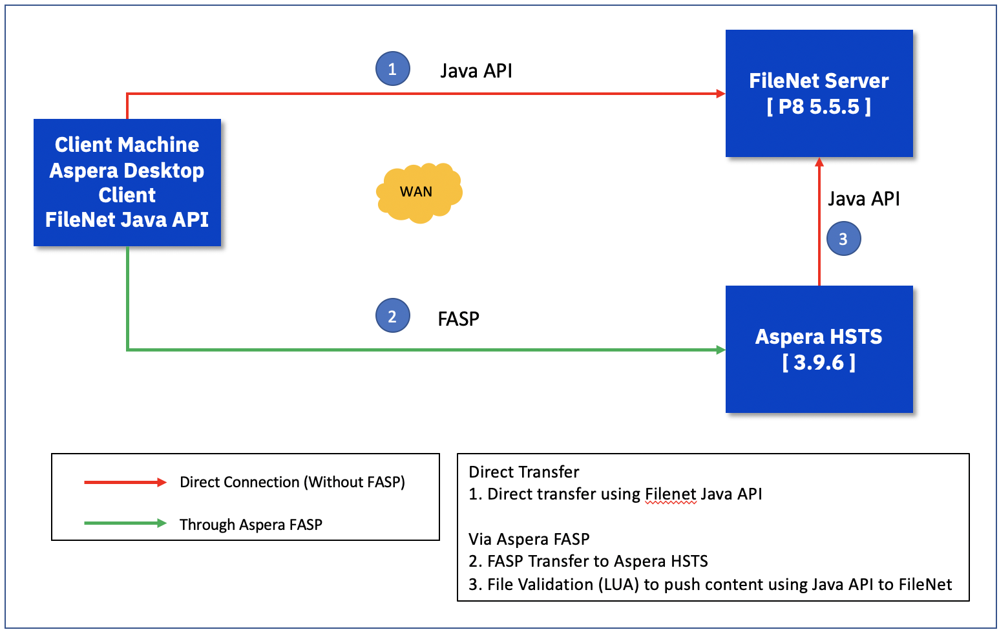
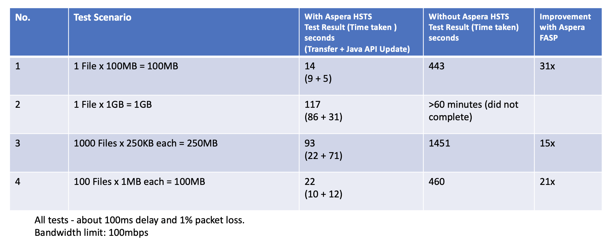

# FileNet-ICN-and-Aspera-Integration
IBM Aspera integration with FileNet
FileNet (IBM Content Navigator - ICN) has a built-in capability to use Aspera FASP technology to upload contents into FileNet. This only works for manual upload. This is a link to a good video that explains how this Aspera integration works.   
[https://www.youtube.com/watch?v=dYYk346vqms](https://www.youtube.com/watch?v=dYYk346vqms)

In this document, I will be explaining how to use Aspera to bulk upload contents to FileNet - either manually or automatically (background job). Files uploaded using Aspera will be pushed into FileNet using Java API at the end of the session.  
*It is possible to push files one-by-one immediately when the transfer completes, but however, it was more efficient to push the files once after the session completes.  *
## Prerequisites
1. Have a FileNet system deployed and configured to accept files. 
2. Aspera based transfers should be disabled in the FileNet Desktop.
3. Have a Aspera High Speed Transfer Server deployed - either in a standalone machine (in the same LAN as FileNet) or in the same machine as FileNet. 
4. Have a Aspera Client machine (Aspera Desktop Client or CLI) deployed. This is a sample architecture. 

5. Get the following details from the FileNet system.
	* Server Name for the FileNet Repository.  
	* Name of the Object Store where the Repository points to.
	* A login id and password to connect to the Content Navigator.
	* A top-level folder where files will be uploaded to.

## Steps for setting up the Demo
1. Configure and Compile the java code
2. Setup pre-post processing in HSTS to update to FileNet after the Transfer SESSION completes. 
3. Test transferring files

### Configure and Compile the Java Code
a. Download the following 2 jar files from Administrative Console for Content Platform Engine (ACCE console).  

 
	Jace.jar.  
	log4j.jar.  

b. Create a working folder  (/opt/software/bulk).  
c. Copy the downloaded jar files to this folder.  
d. Download the file "BulkUploading.java" from BulkFileUpdate folder and copy it into the working folder.  
e. Update the AllVar class and CheckUserFolder sections in "BulkUploading.java" by using the data collected from the FileNet system.  
f. Compile the java file.   
`javac -class-path ".:/opt/software/upload/Jace.jar:/opt/software/upload/log4j.jar:" BulkUploading.java -Xlint:unchecked`  

### Setting up the HSTS 
a. Setup Aspera pre-post (or LUA) execute the compiled java script (prepost.sh). 

	# Perpost   
	if [ $TYPE == Session ]; then   
	  if [ $STARTSTOP == Stop ]; then   
	    java -classpath ".:/opt/software/bulk/Jace.jar:/opt/software/bulk/log4j.jar:/opt/software/bulk:" BulkUploading  $USER  > /tmp/p.log   
	  fi  
	fi   
	

### Test Transferring Files
Drop some files in the source folder ( /data1/asp2 in this case) and test.

`ascp -i <ssh_key> -l 100m --remove-after-transfer /data1/asp2/ asp2@9.30.51.227:/`   

[ascp Command Reference](https://www.ibm.com/support/knowledgecenter/SS4F2E_3.9/cli_user_linux/ascp/ascp_usage.html)   
Check FileNet system if files are updated correctly. 

## Sample Test Result

